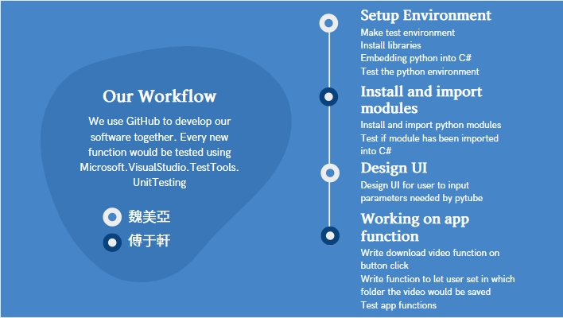
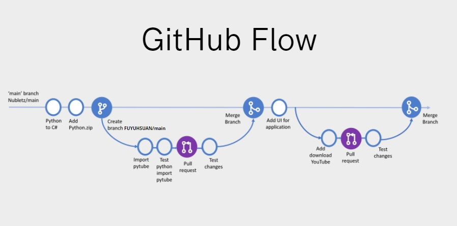
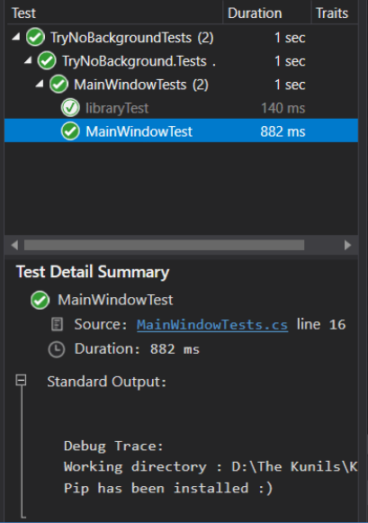
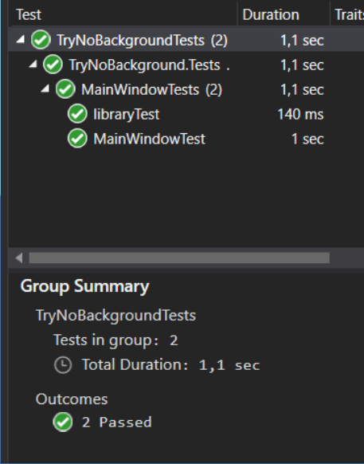
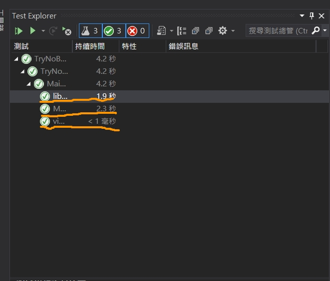
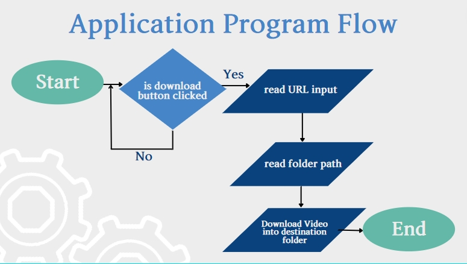
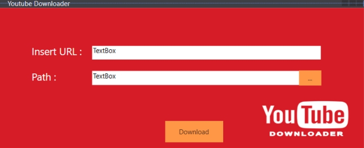
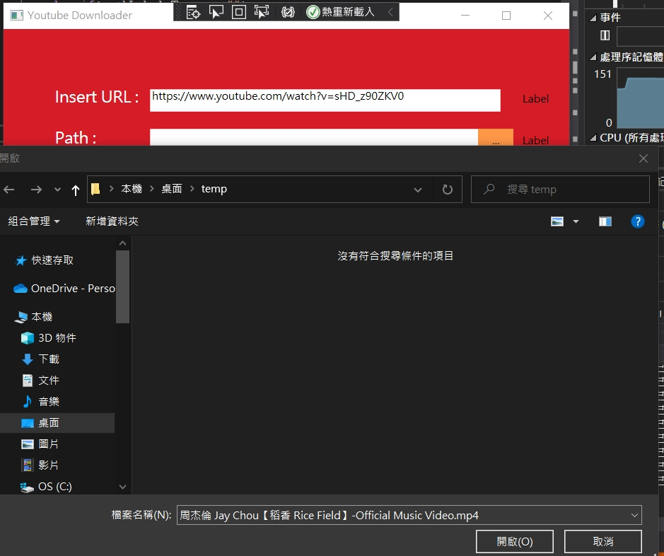
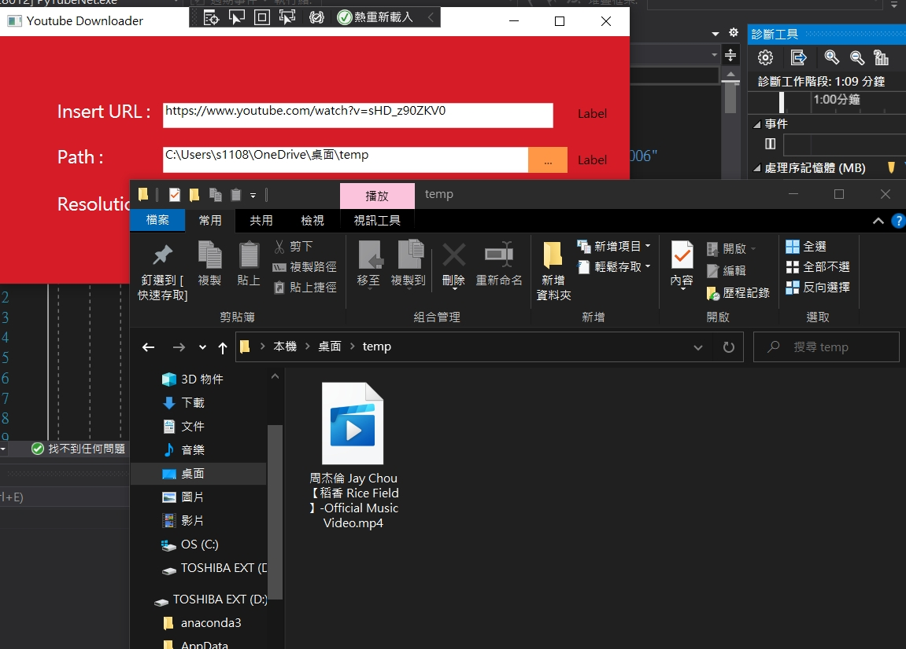

# YouTube_Download(final project)
>* TeamMember:魏美亞、傅于軒
>* 所有程式及UI介面都是原創作品

## 專案說明
* 我們製作一個YouTube的下載器

---

### 專案系統
* 目前功能:能夠透過網址下載YouTube影片到指定資料夾中

---

### 專案執行模式:
1. 首先美亞創造了一個[NubletZ/PyTubeC-](https://github.com/NubletZ/PyTubeC-)的repositories

2. 接下來，我fork美亞所創造的專案[FUYUHSUAN/PyTubeC-](https://github.com/FUYUHSUAN/PyTubeC-?organization=FUYUHSUAN&organization=FUYUHSUAN)，並且在我自己所fork的專案在vscode上來git clone https://github.com/FUYUHSUAN/PyTubeC-.git


3. 接下來美亞會`git push`及`git pull` 來進行程式的撰寫

4. 而我則會需要當美亞`git pull` 之後進行`git fetch upstream`或是`git fetch + 原始我fork的網址`來進行即是更新

5. 當我製作完專案後我需要進行測試，然後將專案git push 上去，接下去給個pull request給美亞

6. 當美亞先測試完之後，就會將專案進行merge

7. 我們的專案便以此為模式進行數輪

---

### 工作分配

* 魏美亞: 
    * 設定環境
        a. 創造測試環境
        b. 安裝函式庫
        c. 將python導入C#
        d. 測試python環境
    * 設計UI介面
    * 管理Github main branch
        a. 允許pull request
        b. 測試每個pull request
* 傅于軒: 
    * 安裝及引用模組
        a. 安裝及引用python模組
        b. 測試並確認所有模組已順利安裝完成
    * 程式功能
        a. 寫按鈕下載鍵之功能
        b. 測試下載影片之函式
        c. 寫讓使用者可以存放資料夾之程式 
        d. 測試打開資料夾之函式
    * 做單元測試


    

## 設計流程:
* 此為我們設計之專案流程這是我們git flow的圖形
    

## 測試:
* 目前我們主要都是進行後端的程式進行測試，至於需要使用前端部分，我們都會將其寫到一開始的函式並進行後端測試


* 以下是我們進行後端程式的寫入開始的部分程式
    * 這三個是可進行單元測試的部分
    * 上層資料夾這是可進行部分測試

    * 單元測試

    
    * 群組測試

    

    
    ```C#
    public static void startPy()
    {
        Installer.InstallPath = Path.GetFullPath("."); //to declare workdir
        Debug.WriteLine($"Working directory : {Path.GetFullPath(".")}");
        Installer.SetupPython();
        string curPath = Directory.GetCurrentDirectory();
        PythonEngine.PythonPath = @$"{curPath}\python-3.7.3-embed-amd64\python37.zip;{curPath}\python-3.7.3-embed-amd64;{curPath}\python-3.7.3-embed-amd64\Lib\site-packages;{curPath}\python-3.7.3-embed-amd64\Lib\site-packages\numpy\core";
        PythonEngine.Initialize();
        if (Installer.IsPipInstalled()) Debug.WriteLine("Pip has been installed :)");
        pyInit = PythonEngine.IsInitialized;

        pytube = PythonEngine.ImportModule("pytube");
        recordpath = Directory.GetCurrentDirectory();
        string tmp = "https://www.youtube.com/watch?v=sHD_z90ZKV0";
        pytube.__main__.YouTube(tmp).streams.get_highest_resolution().download(recordpath);
    }
    ```

* 接下來是寫測試:
    * 這邊的每個程式可以進行Unit測試
    * 並且測試完後，進行Group測試
    ```C#
    [TestMethod()]
    public void MainWindowTest()
    {
        MainWindow.startPy();
        using (var sw = new StringWriter())
        {
            Console.SetOut(sw);
            MainWindow.pyVersion();

            var resVer = sw.ToString().Trim();
            StringAssert.Contains(resVer, "3.7.3");
        }

        bool resInit = MainWindow.pyInit;
        Assert.IsTrue(resInit);
    }

    PyObject dummy;
    [TestMethod()]
    public void libraryTest()
    {
        MainWindow.startPy();
        Assert.IsNotNull(MainWindow.pytube);
    }

    [TestMethod()]
    public void videoTest()
    {
        string filepath = $"{MainWindow.recordpath}/周杰倫 Jay Chou【稻香 Rice Field】-Official Music Video.mp4";
        Assert.IsTrue(File.Exists(filepath), "The video have not been downloaded yet!");
    }
    ```  

* MainWindowTest 的單元測試
    * 這邊主要是確認pyton 3.7.3已經在我們城市中測試正確
```C#
[TestMethod()]
    public void MainWindowTest()
    {
        MainWindow.startPy();
        using (var sw = new StringWriter())
        {
            Console.SetOut(sw);
            MainWindow.pyVersion();

            var resVer = sw.ToString().Trim();
            StringAssert.Contains(resVer, "3.7.3");
        }

        bool resInit = MainWindow.pyInit;
        Assert.IsTrue(resInit);
    }
``` 
* 這邊是確認pyton model pytube 是否順利引入
    ```C#
    PyObject dummy;
    [TestMethod()]
        public void libraryTest()
        {
            MainWindow.startPy();
            Assert.IsNotNull(MainWindow.pytube);
        }
    ```

* 這邊是確認使否順利下載，及存到指定位置
    ```C#
    [TestMethod()]
        public void videoTest()
        {
            string filepath = $"{MainWindow.recordpath}/周杰倫 Jay Chou【稻香 Rice Field】-Official Music Video.mp4";
            Assert.IsTrue(File.Exists(filepath), "The video have not been downloaded yet!");
        }
    ```
---     

## 前端介面
* 主要是輸入URL_link然後選擇想要放的檔案中，將下載的YouTube影片放到指定資料夾



---

## 預見的問題
1. 在一開始的時後，沒有做過Vistual Studio的測試，所以我們花了一些時間去了解該如何進行測試，在測試時會需要知道該使用甚麼來進行測試，例如IsTrue,IsNotNull...這些該使用哪種進行測試，最後也順利經過討論及查資料找出了正確的使用方法

2. 在push 上去時候遇到中英文的問題，以後在這種要跨語言合作時會使用國際語言或使較多人使用之語言進行合作，避免衝突

## 執行結果
* 執行前

* 執行後



