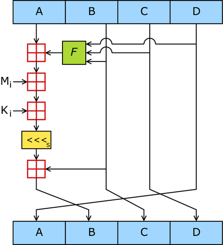

# MD5
* 加密演算法
* 可產生128bits的位元(16bytes)的雜湊值
* 可資訊傳播完整性

特點:
1. 正向快速
2. 逆向困難
3. 輸入不同，輸出差異大
e.g
MD5("The quick brown fox jumps over the lazy dog")
= 9e107d9d372bb6826bd81d3542a419d6
即使在原文中作一個小變化（比如用c取代d）其雜湊也會發生巨大的變化：

MD5("The quick brown fox jumps over the lazy cog")
= 1055d3e698d289f2af8663725127bd4b
4. 衝突避免
MD5("")
= d41d8cd98f00b204e9800998ecf8427e

目前使用範圍:
1. 數據較驗
2. 安全加密

演算法
輸入:不固定長度
經過:生成四個32bits資料
輸出:連接成固定長度128bits

缺陷:
碰撞抵抗被破解

運用求餘、取餘、調整長度與連結變數的方式進行迴圈運算

XOR, AND, OR , NOT 的符號


以下定義

```c

// MD5演算法所定義的區段
/*
F(X, Y, Z) = (X & Y) | (~X & Z)
G(X, Y, Z) = (X & Z) | (Y & ~Z)
H(X, Y, Z) = X ^ Y ^ Z
I(X, Y, Z) = Y ^ (X | ~Z)
*/
uint32_t F(uint32_t X, uint32_t Y, uint32_t Z){
    return (X & Y) | (~X & Z);
}

uint32_t G(uint32_t X, uint32_t Y, uint32_t Z){
    return (X & Z) | (Y & ~Z);
}

uint32_t H(uint32_t X, uint32_t Y, uint32_t Z){
    return X ^ Y ^ Z;
}

uint32_t I(uint32_t X, uint32_t Y, uint32_t Z){
    return Y ^ (X | ~Z);
}
```

---

MD5運算由四組16次迴圈組成64的迴圈結構
1. F :非線性函式，一個函式運算一次
2. Mi : 32-bits輸入
3. Ki : 表示 32 bits常數，用來完成每次不同計算



```c
//使用主要MD5 演算法對512bits進行步進
void md5Step(uint32_t *buffer, uint32_t *input){
	uint32_t AA = buffer[0];
	uint32_t BB = buffer[1];
	uint32_t CC = buffer[2];
	uint32_t DD = buffer[3];

	uint32_t E;

	unsigned int j;

	for(unsigned int i = 0; i < 64; ++i){
		switch(i / 16){
			case 0:
				E = F(BB, CC, DD);
				j = i;
				break;
			case 1:
				E = G(BB, CC, DD);
				j = ((i * 5) + 1) % 16;
				break;
			case 2:
				E = H(BB, CC, DD);
				j = ((i * 3) + 5) % 16;
				break;
			default:
				E = I(BB, CC, DD);
				j = (i * 7) % 16;
				break;
		}

		uint32_t temp = DD;
		DD = CC;
		CC = BB;
		BB = BB + rotate_left(AA + E + K[i] + input[j], S[i]);
		AA = temp;
	}

	buffer[0] += AA;
	buffer[1] += BB;
	buffer[2] += CC;
	buffer[3] += DD;
}
```

---

測試:
首先:需要先make
接著，只需要./md5 + "所需要便為雜湊值的字串"
```
s1108@DESKTOP-IJI9NA5 MINGW64 /d/Vscode/sa110/sa110a/midterm/MD5/example/md5-c (main)
$ ./md5 "Hello, World!"
65a8e27d8879283831b664bd8b7f0ad4
```

```
s1108@DESKTOP-IJI9NA5 MINGW64 /d/Vscode/sa110/sa110a/midterm/MD5/example/md5-c (main)
$ ./md5 "Hello, World"                                                                                                                                          
82bb413746aee42f89dea2b59614f9ef
```

由此兩個例子可以看出差一個字或詞，差別就蠻大的

```
s1108@DESKTOP-IJI9NA5 MINGW64 /d/Vscode/sa110/sa110a/midterm/MD5/example/md5-c (main)
$ ./md5 "The quick brown fox jumps over the lazy dog"
9e107d9d372bb6826bd81d3542a419d6
```


參考資料:
https://zh.wikipedia.org/wiki/MD5
https://www.010tools.com/MD5
https://github.com/Zunawe/md5-c
https://datatracker.ietf.org/doc/html/rfc1321