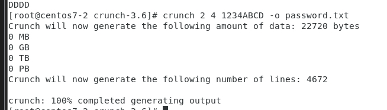
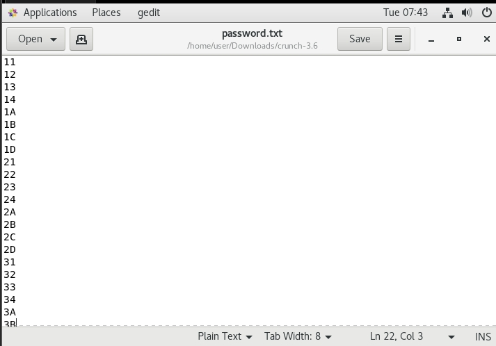

# crunch
* 先在linux中下載[crunch](https://sourceforge.net/projects/crunch-wordlist/)
* [參考資料](https://www.hackers-arise.com/creating-a-custom-wordlist-with-cru)

* 下載完後解壓縮`tar -xvf crunch-3.6.tgz`

* 並設路徑，這樣即可載整個地方都可使用`export PATH=$PATH:/home/user/Downloads/crunch-3.6`，因為我在這邊是存載 Downloads 中，所以將PATH設成這邊

* 接著就可以嘗試`crunch 2 4 1234ABCD -o password.txt`，這個可以生出2~4之間，隨機數字的密碼檔

    
    