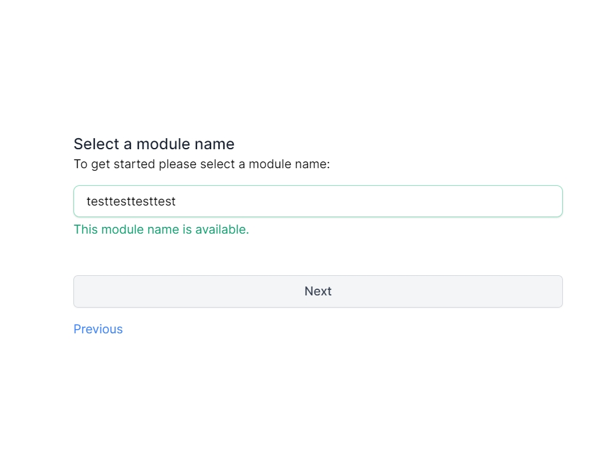

# 發布deno 

## vscode 上面的操作
* 先將想要的專案fork到我們的資料夾
* 接著將修改完的放入我的的資料夾
* 接著依照以下動作即完成
* git tag v幾 --> 這個是第幾版
1. git clone link
2. 在裡面做修改
3. git add -A
4. git commit -m "add"
5. git tag v0.1
6. git push origin v0.1

-> manage access

---
## 網站上面的操作

* 首先，先把需要發布的專案放在想要Repositories中，建議新增一個Repositories來放
* 接著， 進入[deno third part model](https://deno.land/x) 點一下 `Publish a module`

* 接著，點next

* 接下來要在`Select the model name`裡面填上一個沒有人填過的名字

* 接著按下next會出現以下，直接按next

* 接著會出現教導如何發布的網頁

* 接著回去github點選想要發布的Repositories
* 點選 setting -> Webhooks ->Add webhook，然後會出現以下畫面
* 將剛剛deno網站上所給的URL貼上

* 將content type 改成`application/json` 
* 將Which events would you like to trigger this webhook? 改成` Let me select individual events`

* 接下來在底下勾選`Branch or tag creation`

* 最後點選Add Webwood就完成了